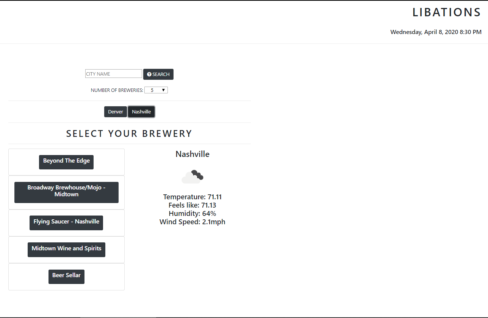
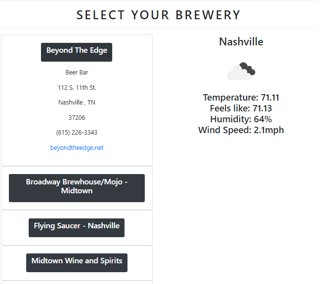
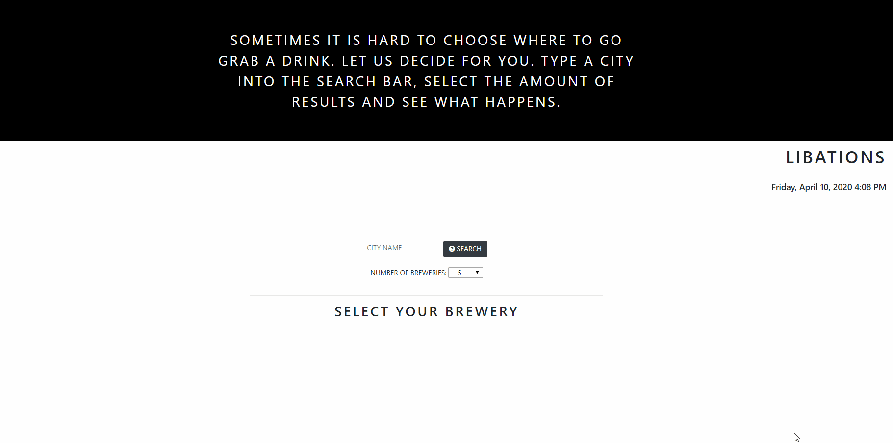

  <h1 align= "center">Libations</h1> 
  <li>See here:<a href= "https://armcbride.github.io/libations/" target ="_blank">https://armcbride.github.io/libations/</a></li>
  <h3>Table of Contents<h3>
  <ul>
  <li><a href="#descrip">Description</a></li>  
  <li><a href="#install">Installation</a></li> 
  <li><a href="#tech">Technology</a></li> 
  <li><a href="#use">Usage</a></li> 
  <li><a href="#license">License</a></li>
  <li><a href="#screen">Screenshots</a></li> 
  <li><a href="#contr">Contributors</a></li> 
  <li><a href="#tests">Tests</a></li>
  <li><a href="#quest">Questions</a></li>  
  </ul>
    

  
<h3>Description</h3> 

  Search a city, find local breweries.
  

  
<h3>Installation</h3> 

  
none

  

  
<h3>Technology</h3>
           
  
 HTML, CSS, Bootstrap, APIs,JSON,, JavaScript, jQuery

  

  
<h3>Usage</h3>

  
Type in a city in the United States, selected the amount of results to be viewed, and see the results, coupled with the local weather. Search locates breweries, beer bars, beer stores, and brewpubs.
  
  

  
<h3>License</h3>

  

 
  

  
<h3>Screenshots</h3>

  

  

  
<h3>Contributors</h3> 

  
armcbride, chaalexander
 
  

  
<h3>Tests</h3>

  

  

  
<h3>Questions?</h3> 

           
    Contact: Annaruth McBride       
  <ul>
  <li>Github: <a href= "https://github.com/armcbride">https://github.com/armcbride</a></li>
  <li>Portfolio: <a href= "armcbride.github.io">armcbride.github.io</a></li>
  <li>Email: <a href= "mailto:armcbride17@gmail.com">armcbride17@gmail.com</a> </li>     
  <li>LinkedIn: <a href= "https://www.linkedin.com/in/annaruthmcbride">https://www.linkedin.com/in/annaruthmcbride</a></li>
  </ul> 
  
